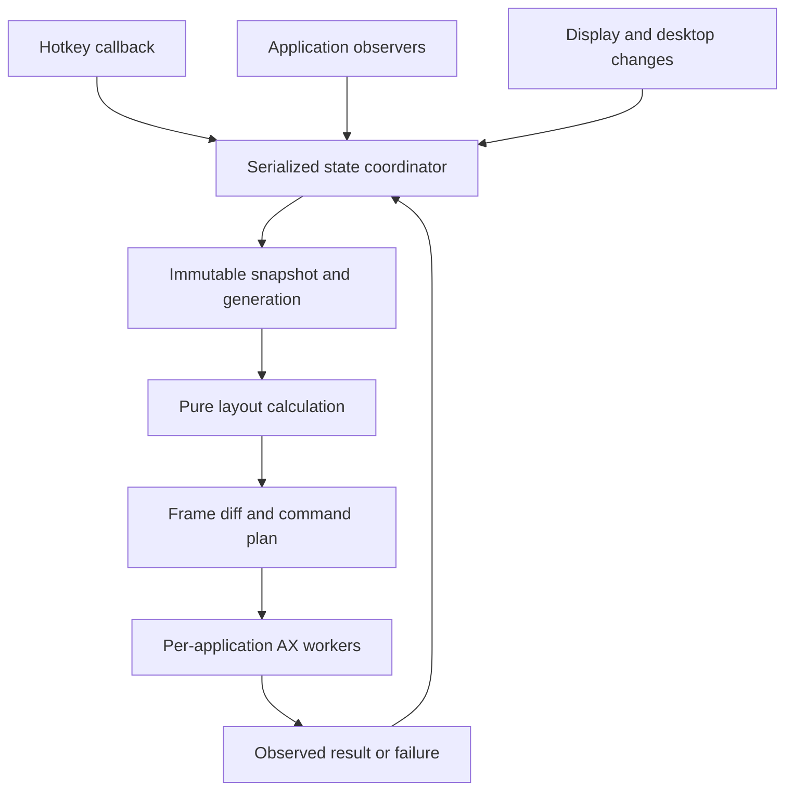

# Architecture

## Implementation boundary

Implemented today: `LayoutNode`, `Rect`, `LayoutEngine`, pure probe identity registry and coordinate transform, trust-status query, permission-settings onboarding, explicit read-only per-application discovery on dedicated AX threads, destruction observers, redacted reports, pause/quit, and packaging. See [M1 probe](m1-probe.md) for the implemented limits. M2.1 also implements a pure control reducer, immutable control records, and simulated admission with deterministic fake-worker tests; see [its boundary](m2-control-model.md). M2.2 adds [structured focused-window reads and revalidation](m2-focused-probe.md) to the existing dedicated worker, with frontmost/activation checks before report presentation. Its real-window acceptance is partial and its evidence never establishes eligible control. The live coordinator/worker admission mailbox, platform enrollment, mutation, hotkeys, and automatic reconciliation described below remain proposed contracts.

The second-pass contracts are authoritative where the initial outline was incomplete: [ADR 0002](decisions/0002-control-boundary.md), [control contracts](control-contracts.md), and [platform experiments](platform-experiments.md). Real writes are gated on those experiments.

The [2026-10-04 readiness review](m1-readiness.md) consolidates experimental coverage and specified M2.1: pure control state and simulated admission before real setter integration. That simulation task and the focused read-only observation/revalidation source are now implemented. A synchronized owned-fixture check observed in-flight focus-loss rejection; permission/environment races remain manual acceptance work. It does not mark M1's remaining platform gates complete.

## Modules

| Module | Responsibility | Must not own |
| --- | --- | --- |
| ITileCore | Window tokens, layout tree, commands, snapshots, pure geometry | AppKit, AX references, threads, filesystem |
| ITilePlatform | Discovery, AX observers/workers, screen conversion, hotkeys | Layout policy or mutable global tree |
| ITileApp | Lifecycle, composition, menu, configuration, state coordination | Blocking AX operations on its main thread |

The core currently uses session-local integer identifiers and a binary split tree. Binary splits keep the initial model small; this is not i3's complete n-ary container model. Each window appears once; ratios are finite and strictly between zero and one. A solve returns a complete frame map or an error. It never performs external side effects.

## Event and command flow

AppKit stays on the main thread. The state coordinator is the sole owner of mutable layout state and uses a Swift actor with explicit nonblocking reduction and version-checked replies. Synchronous AX calls must run on dedicated application workers, not on the main thread or Swift's cooperative executor. Each worker owns its AX elements and observer run loop; do not broadly mark AX handles unchecked Sendable to bypass ownership problems.

Commands reduce in order and advance a layout revision. Desktop/display invalidations advance a separate environment epoch. Each worker keeps the latest pending absolute target per window and verifies identity, epoch, revision, and admission before each setter/action. An in-flight synchronous call cannot be safely assumed cancelled; stale completions trigger observation/reconciliation, never a stale tree replacement. Permit at most one write sequence per application at a time. Worker teardown follows application termination; avoid unbounded queue growth.

## Window identity and discovery

Use an internal token scoped to application process lifetime and registry generation. AX element equality can help correlate windows within that lifetime. Do not use title strings as identity, assume PIDs cannot be reused, or depend on private AX-to-window-ID functions. Public window-list metadata may assist visibility, but mapping it to AX elements is an explicit research task. Ambiguity should reduce coverage rather than move the wrong window.

Begin with explicitly focused-window enrollment; bulk enrollment is gated on visibility evidence. Invalidate enrollment on environment changes.

Observe application launch/termination and window create/destroy/focus changes. Notification support varies; reconcile after explicit commands and recovery events, with a bounded low-frequency fallback only if measurements show it necessary. Avoid continuous global enumeration and title harvesting.

## Geometry and frame application

Core coordinates use logical points, x rightward and y downward. Convert AppKit's bottom-origin global coordinates at the platform boundary using the primary display reference; preserve negative coordinates. Use available screen area, account for menu bar/Dock, and test mixed scale factors. Pixel snapping is not implemented in the core scaffold.

Before writing, check role/subrole, minimized/fullscreen state, and whether position/size attributes are settable. Minimum sizes are not uniformly discoverable. Compare requested and observed geometry; after bounded attempts, mark constrained or float the window. Never retry forever.

AX position and size updates are not an atomic desktop transaction. Apply only meaningful differences with a documented tolerance (initial proposal: one logical point). App-specific ordering may be necessary. Retain recent expected frames to recognize self-generated notifications, but expire that record so genuine mouse movement is not ignored.

## Fault isolation

Use explicitly configured AX messaging timeouts on the actual handles (or a deliberate process-wide default) and application backoff; Swift task cancellation alone does not interrupt a blocked AX request. Exact timeout values are measurement-driven. No worker may hold a coordinator lock during IPC. If one app is unhealthy, suspend its management and continue handling other apps. If visibility becomes ambiguous after Mission Control, fullscreen, Space transition, wake, or display hotplug, invalidate plans and return to conservative discovery.

Process crashes should leave windows visible in their last real positions; no offscreen hiding is used. Pause and quit revoke new write admission; already admitted AX calls may complete afterward. Quit stops observers and input interception without waiting indefinitely for blocked workers. Restoration of original frames is a separate best-effort command, never a promise to recreate the complete previous desktop.

## Keyboard boundary

Use a public Core Graphics event tap for configured chords. Its callback only recognizes bindings, enqueues a command, and returns; never solve layouts, perform AX IPC, or launch a subprocess there. Install no global bindings until explicitly enabled. Consume only admitted chords and track down/repeat/up as one key lifecycle. Handle tap disablement, key repeat, modifier changes, secure-input limitations, permission revocation, and non-US layouts explicitly. Global input capabilities must be requested only when that feature is enabled. Never record raw key streams.

## Configuration, diagnostics, and performance

Foundation JSON decoding, strict validation, atomic replacement of valid configuration. Apple Logger/signposts for counts, durations, generations, and redacted failure categories. Do not log titles, URLs, document paths, or raw keys. Debug exports are explicit and reviewed by the user.

Initial performance hypotheses: p95 internal command-to-plan under 5 ms for 20 windows; near-idle CPU when nothing changes; bounded memory over long sessions. Measure command-to-AX-write and observed completion separately. These are targets, not benchmark results or hard real-time guarantees.

## Sources

- [AXUIElement APIs](https://developer.apple.com/documentation/applicationservices/axuielement_h)
- [Core Graphics events](https://developer.apple.com/documentation/coregraphics/cgevent)
- [NSScreen visibleFrame](https://developer.apple.com/documentation/appkit/nsscreen/visibleframe)
- [Native Space change notification](https://developer.apple.com/documentation/appkit/nsworkspace/activespacedidchangenotification)
- [AeroSpace's documented macOS constraints](https://nikitabobko.github.io/AeroSpace/guide)

API details must be checked against the installed SDK when implementing the adapter. Public APIs reduce compatibility risk; they do not guarantee universal window support.
